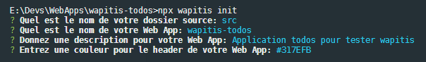
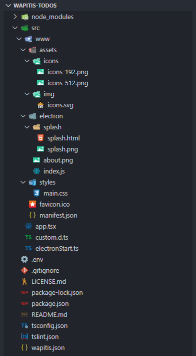
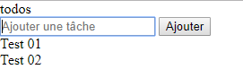
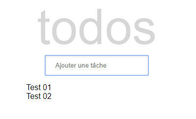
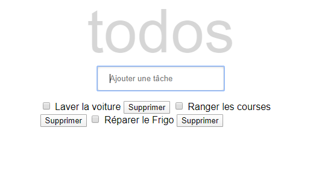
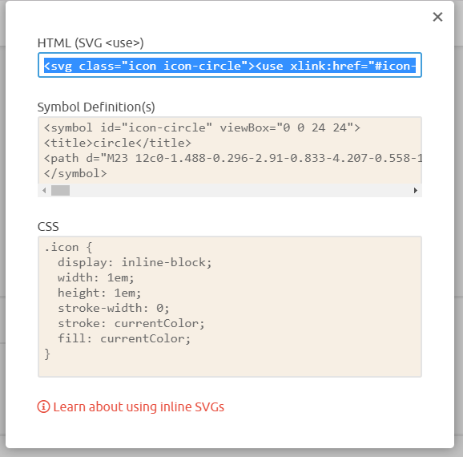
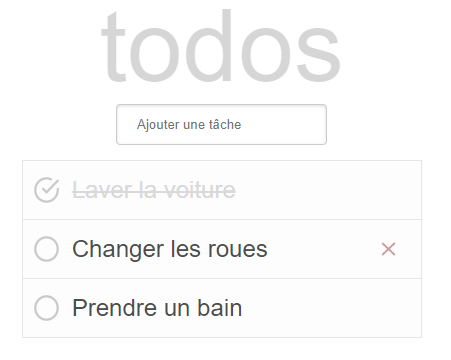
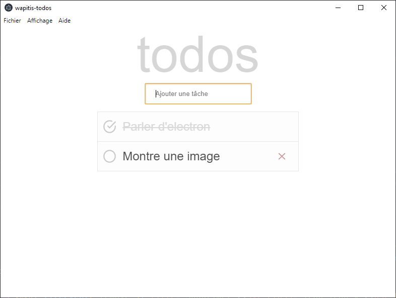
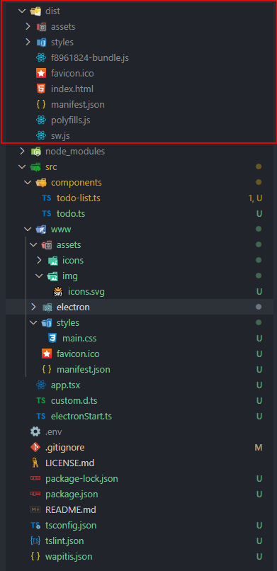

# WApiTis 2


> WebApp utiliTies est un set d'outils pour développer et compiler une application web avec ou sans client lourd. Il ne s'agit pas d'un framlework. Il ne contient pas de composants préexistants (cela sera l'objet d'un autre projet).
>
> L'idée est ainsi plus de faciliter la mise en oeuvre de ses composants grâce aux web components et à la surcouche qui y est apportée et qui sera décrite plus bas.
>
> Afin de faciliter la compilation de cette application, des scripts en ligne de commanbde permettent très rapidement d'initialiser, de tester et de publier en production pour une sortie sur le Web ou dans une épplication packagée.

## Technologies utilisées

Pour développer plus facilement et permettre une mise en place plus facile des composants, Wapitis utilise les [webcomponents](https://developer.mozilla.org/fr/docs/Web/Web_Components). Plus particulièrement une surcouche y est apportée ajoutant encore plus de simplicité.

Cette surcouche fonctionne un peu comme [LitElement](https://lit-element.polymer-project.org/). Au lieu d'étendre HTMLElement, le composant créé étend une classe de base appelé `Component` permettant:
- d'accéder simplement au cycle de vie du composant
- d'appliquer un style
- de créer des propriétés dynamiques ou non
- de mettre à jour le contenu

Le langage utilisé est [typescript](https://www.typescriptlang.org), permettant un contrôle plus poussée des types et des classes et une aide à la saisie facilitée.

Pour mettre à jour le contenu, Wapitis se base sur [lit-html](https://lit-html.polymer-project.org/) qui vous permet d'écrire des modèles HTML en JavaScript à l'aide de template et d'expressions JavaScript intégrées. lit-html identifie les parties statiques et dynamiques de vos modèles afin qu'il puisse mettre à jour efficacement uniquement les parties modifiées.

En utilisant lit-html, Wapitis met à jour le contenu dans des shadow DOM et ajoute une API pour gérer les propriétés et les attributs. Il est alors possible de décider quelles propriétés seront observées et les éléments sont alors mis à jour de façon asynchrone seulement à l'endroit où les propriétés changent ou interagissent avec le contenu.

Une librairie de fonctions est également disponible afin de permettre d'accéder rapidement aux différents éléments du DOM ou du shadow DOM.

Afin de faciliter la diffusion, Wapitis utilise [FuseBox](https://fuse-box.org) pour compiler rapidement des versions de dev ou de prod. Ajoutons à cela l'utilisation d'[electron](https://electronjs.org/) pour concevoir des applications sous forme de client lourd installable, le tout intégré de façon simple et facilement accessible.

L'utilisation des lignes de commandes permet ainsi d'accéder rapidement et facilement à toutes ces fonctions sans avoir besoin de configurer quoi que ce soit.

## Disclaimer

Il existe d'autres librairies plus connues ou plus puissantes comme React ou LitElement, alors pourquoi Wapitis ?

Premièrement, de mon côté, cela me permet un contrôle sur tous les élements composants cet outil, qu'il s'agisse de ce que je veux intégrer et de comment cela est codé. D'autre part cela assure que ce qui est inclus est utile.

Enfin il s'agit d'un outil complet de création de WebApp, icluant tout ce qui est nécessaire, avec simplicité.

Afin de gérer correctement l'affichage de lit-html et typescript, j'utilise pour ma part [Visual Studio Code](https://code.visualstudio.com/) avec quelques plugins dont :
- [lit-plugin](https://marketplace.visualstudio.com/items?itemName=runem.lit-plugin)
- [TSLint](https://marketplace.visualstudio.com/items?itemName=ms-vscode.vscode-typescript-tslint-plugin)

electron a été bloqué à la version  7.1.1 car la verion 7.1.4 avait un bug avec electron-updater : `redirect was cancelled sur un test de update-available`. Dès que possible, je reviendrais sur la version en cours.

Lors de l'installation d'un executable via electron, windows a un avertissement lié à son application smart screen. Les seules solutions pour éviter cette avrtissement sont :
- signer l'application (ce qui coute de l'argent)
- ignorer cette alerte
- désactiver smart screen ;)

**TODO :**
- Intégration de [Capacitor](https://capacitor.ionicframework.com/)
- Gestion d'une liaison avec IndexedDB dans le Service Worker pour les données provenant d'une base de données

## Features

- Générer une application web grâce à [FuseBox](https://fuse-box.org)
- Générer une application [electron](https://electronjs.org/)
- Mise à jour asynchrone du DOM grâce à [lit-html](https://lit-html.polymer-project.org/)
- Utilisation possible de jsx via l'import d'un fichier jsx.ts
- Divers méthodes  disponibles grâce à l'import du fichier log.ts, dom.ts, shadowDom.ts et utils.ts
- Créer vos components et vos classes et générer votre application via des lignes de commande
- Surcouche des web components à travers une classe de base permettant de simplifier la mise à jour de contenus et l'accessibilité au cycle de vie et aux différentes méthodes
- Styler et surcharger les styles directement dans les composants
- Utilisation de SVG pour gérer les icons
- Pré-intégration d'un service-worker, permettant à la web app de fontionner hors ligne


## Pour commencer

Afin de tester le fonctionnement de l'outil, nous allons essayer de créer une application de TODOS

Commençons pas l'installation. Dans un dossier de votre choix, initaliser npm via **npm init**

Puis installer et initialiser Wapitis

    npm i wapitis -D
    npx wapitis init

Répondez aux questions. Dans notre cas :



L'installation se poursuit alors avec ts-lint et electron-updater.

Une fois l'installation terminée les sources se présentent ainsi :



- wapitis.json contient les divers éléments permettant la création de l'application.
- tslint.json permet de mettre en place l'aide à la saisie.
- tsconfig.json configure comment typescript doit fonctionner.
- .env contient les divers variables d'environnement nécessaires au bon fonctionnement de wapitis
- le dossier src contient les sources de l'applications. A commencer par les assets (images, icons, fonts ...)
- le dossier electron contient un fichier splash.html avec une icon éditable qui sera visible lors du lancement de l'application
  - about.png est éditable et comme son nom l'indique est visible dans la fenetre à propos de l'application electron
  - index.js contient le code js permettant de créer la popup de mise à jour et de recevoir les messages en provenance de l'application.
  - electronStart.ts est le fichier permettant de lancer l'application electron et contient la création des menus et des messages envoyés par l'application
- manifest.json est le manifest necessaire pour permettre d'installer l'application comme une WebApp
- main.css contient les css générales de l'application (il ne s'applique pas aux différents composants qui contiennet leurs propres styles)
- app.tsx est le point de départ de l'application. L'endroit ou nous appellerons le fichier racine de notre WebApp

Pour créer notre application, nous aurons besoin de deux composants:

    TodoList
        Input de text pour ajouter une tâche
        Liste des tâches
    Todo
        Case à cocher pour marquer complété
        Texte
        Bouton de suppression

TodoList aura une propriété observée todos : un array contenant la liste  des todos
Todo aura 3 attributs : checked, text, index, peut etre plus

Nous commencerons donc par créer un composant en utilisant la ligne de commande suivante :

    npx wapitis generate component components/todo-list.ts

Le fichier suivant est alors créé :

```Typescript
import { Component, css, customElement, html, property, PropertyValues } from 'wapitis'

interface IProps {
    maVariable: string
}

// Entrez le nom du composant (x-nameOfComponent) par défaut en paramètre de register => recquis
@customElement()
export default class Custom extends Component<IProps> {

    static get styles() {
        return css`
        :host {
            /*  */
        }
        `
    }

    @property() maVariable: string

    constructor(options: IProps) {
        super(options)
    }

    connectedCallback() {
        super.connectedCallback()
    }

    attributeChangedCallback(attrName: string, oldVal: any, newVal: any) {
        super.attributeChangedCallback(attrName, oldVal, newVal)
    }

    shouldUpdate(_changedProperties: PropertyValues): boolean {
        return true
    }

    beforeRender(_changedProperties: PropertyValues) {
        //
    }

    render() {
        return html`
            <!--  -->
        `
    }

    firstUpdated(_changedProperties: PropertyValues) {
        //
    }

    updated(_changedProperties: PropertyValues) {
        //
    }

    disconnectedCallback() {
        super.disconnectedCallback()
    }

}
```

Ce fichier contient les méthodes accessible tout le long du cycle de vie du composant nouvellement créé (pour en savoir plus voir plus bas)

Nous allons l'éditer de cette façon :
```Typescript
import { Component, customElement, html, property } from 'wapitis'

// Nous définissons notre custom element dans la directive suivante et la classe associée
// w pour wapitis. il est obligatoire d'avoir "prefixe-nom" dans le nom d'un custom element
@customElement('w-todo-list')
export default class TodoList extends Component<{}> {
    // Une propriété _todos est déclaré avec la directive @property en indiquant le type dont il s'agit ici un Array d'objet
    // Le préfixe _ permet à la propriété d'être obervable tout en étant considérée comme protected. Elle n'apparait ainsi pas dans les attributs de l'élément il n'y a donc pas de conversion
    @property() _todos: Array<{ text: string; }> = []
    // Une propriété input non observable et protected est déclarée pour pouvoir y accéder ci après
    protected _input: HTMLInputElement | null

    render() {
        // On utilise ensuite le helper html afin de créer un template avec les événements et les variables observées à mettre à jour
        // @click correspond à addEventListener('click', this.addTodos)
        // La partie du template this._todos est mis à jour car il s'agit d'une propriété observable
        // L'écriture est ici également la même que https://lit-html.polymer-project.org/guide/template-reference
        return html`
            <div class='title'>todos</div>
            <form>
                <input type='text' placeholder='Ajouter une tâche'/>
                <button @click=${this._addTodo}>Ajouter</button>
            </form>
            <div class='todos'>
                ${this._todos.map((todo) => html`<div>${todo.text}</div>`)}
            </div>
        `
    }

    // On va chercher l'élément input
    firstUpdated = () => this._input = this.shadowRoot!.querySelector('input')

    // On ajoute à la propriété _todos la nouvelle tâche créée. C'est la methode render qui se charge de l'affichage lorsque _todos change
    protected _addTodo = (event: MouseEvent) => {
        event.preventDefault()
        if (this._input!.value.length > 0) {
            this._todos = [...this._todos, { text: this._input!.value }]
            this._input!.value = ''
        }
    }
}
```
Voir directement dans le code pour avoir les informations sur la création de ce composant

Afin de voir le résultat, il est nécessaire d'appeler ce composant. Nous pouvons le faire facilement dans la racine de l'application app.tsx.

Nous allons utiliser ici JSX afin d'appeler directement le composant en Javascript, en modifiant le fichier app.tsx de cette façon

```Typescript
import { JSX } from 'wapitis'
import TodoList from './components/todo-list'
import './www/styles/main.css'

document.body.appendChild(<TodoList></TodoList>)
```

Enfin pour voir le résultat nous allons lancer un serveur de test en exécutant la ligne de commande :
```
npx wapitis dev
```
Et en nous rendant sur : http://localhost:4444/

Cela donne :



Afin d'améliorer un peu la présentation, nous allons intégrer un peu de stylage. Les composants portent leur stylage, ce qui rend très facile leur utilisation. De plus avec les shadow DOM, les CSS sont bloqués à l'intérieur du composant, ce qui veut dire que les CSS des autres composants n'agissent pas sur lui et inversement.

Il y a évidemment des passerelles et des surcharges possibles, comme cela sera expliqué plus loin dans la doc.

Ici nous allons transformer le code en ajoutant

```Typescript
export default class TodoList extends Component<{}> {
    static get styles() {
        return css`
        :host {
            font-family: Arial, Helvetica, sans-serif;
            margin: auto;
            width: 25rem;
            display: flex;
            flex-direction: column;
            align-items: center;
        }
        .title {
            font-size: 100px;
            opacity: 0.2;
            color: #333333;
        }
        input {
            border: 1px solid #ccc;
            box-shadow: inset 0 1px 3px #ddd;
            border-radius: 4px;
            padding: 12px 20px;
        }
        button {
            display: none;
        }
        .todos {
            width: 25em;
            margin-top: 1rem;
        }
        `
    }

    @property() _todos: Array<{ text: string; }> = []

    ...
```
Ce qui donne :



On pourrait s'arrêter ici, mais nous voulions également pouvoir supprimer les tâches et les marquer comme réalisées. Pour ce faire nous allons créer un autre composant que nous pourrons ensuite instancier dans le composant TodoList

```
npx wapitis generate component components/todo.ts
```

Un fois le composant créé, il est édité comme ceci (Lire les commentaires pour comprendre le fonctionnement)

```Typescript
import { Component, customElement, html, property, UTILS } from 'wapitis'

// On déclare les prporiétés puvliques obsevables. Ainsi si un constructor est déclarée on peut utiliser la forme new Todo({...}) pour créer la Todo. Et cela permet aux composants appelant d'avoir connaissances de ces propriétés
interface IProps {
    text: string
    index: number
    checked: boolean
}

@customElement('w-todo')
export default class Todo extends Component<IProps> {
    // On déclare les 3 propiétés observable en utilisant la directive @property. Comme il s'agit d'attribut, afin d'indiquer comment la conversion doit être faite entre l'attribut et la propriété, on indique le type pour index et checked, text étant un string il est inutile de l'indiquer. writeOnly est passé à true pour l'index afin qu'il n'apparaisse pas en tant qu'attribut html dans le dom
    @property() text: string
    @property({ type: Number, writeOnly: true }) index: number
    @property({ type: Boolean }) checked: boolean = false

    render() {
        // https://lit-html.polymer-project.org/guide/template-reference
        // On utilise .checked pour indiquer qu'on utilisera une valeur true ou false pour l'attribut html checked de l'input dans le DOM
        // Un custom event est utilisé pour préciser aux autres composants que la tâche est complétée ou supprimée (cf todo-list pour voir comment cela est traité)
        // Un autre custom event est utilisé pour preciser que la tâche est supprimée
        return html`
            <label>
                <input .checked=${this.checked} @change=${() => this._fireEvent('completed')} type='checkbox'/>
                <span>${this.text}</span>
            </label>
            <button @click=${() => this._fireEvent('remove')}>Supprimer</button>
        `
    }

    // Une fonction générique est créée pour envoyer le custom event
    // On utilise ici une des méthodes disponibles dans la librairie UTILS : dispatchEvent permettant d'envoyer un custom event
    protected _fireEvent = (name: string) => UTILS.dispatchEvent(name, { index: this.index }, this)
}
```

Nous allons ensuite modifier todo-list afin de déclarer le nouveau composant créé et les méthodes nécessaires à son fonctionnement.

```Typescript
import { Component, css, customElement, html, property } from 'wapitis'
// On importe le composant
import './todo'

...

render() {
        // On utilise ensuite le helper html afin de créer un template avec les événements et les variables observées à mettre à jour
        // @click correspond à addEventListener('click', this.addTodos)
        // La partie du template this._todos est mis à jour car il s'agit d'une propriété observable
        // L'écriture est ici également la même que https://lit-html.polymer-project.org/guide/template-reference
        // On remplace l'ancien div par le composant w-todo en déclarant les différentes variables
        // text et index avec un . car c'est une valeur
        // .checked permet d'indiquer qu'il s'agit d'un booleen. En tant qu'attribut seul checked sera écrit quand l'attribut sera à true. S'il est à false il ne sera pas présent
        // Enfin commen on ferait un addEventListener sur les custom event de ce composant on pose ici un @ accompagné du nom de ce custom event et d'une méthode associée
        return html`
            <div class='title'>todos</div>
            <form>
                <input type='text' placeholder='Ajouter une tâche'/>
                <button @click=${this._addTodo}>Ajouter</button>
            </form>
            <div class='todos'>
                ${this._todos.map((todo, index) => html`<w-todo ?checked=${todo.checked} text=${todo.text} .index=${index} @remove=${this._removeTodo} @completed=${this._toggleTodo}></w-todo>`)}
            </div>
        `
    }

    // On va chercher l'élément input
    firstUpdated = () => this._input = this.shadowRoot!.querySelector('input')

    // On ajoute à la propriété _todos la nouvelle tâche créée. C'est la methode render qui se charge de l'affichage lorsque _todos change
    protected _addTodo = (event: MouseEvent) => {
        event.preventDefault()
        if (this._input!.value.length > 0) {
            this._todos = [...this._todos, { text: this._input!.value, checked: false }]
            this._input!.value = ''
        }
    }

    // On supprime l'index demandé en filtrant le tableau existant grâce à l'index. La mise à jour du tableau permettra à la methode render de remplacer les élément nécessaires dans le template
    protected _removeTodo = (event: CustomEvent) => this._todos = this._todos.filter((todo, index) => index !== event.detail.index)

    // On remplace dans le tableau la propriété checked par la valeur renvoyée grâce à l'index. La mise à jour du tableau permettra à la methode render de remplacer les élément nécessaires dans le template
    protected _toggleTodo = (event: CustomEvent) => this._todos = this._todos.map((todo, index) => index === event.detail.index ? { ...todo, checked: !todo.checked } : todo)
}
```

Cela nous donne ainsi



Afin d'améliorer le rendu, un peu de stylage est nécessaire

```Typescript
// On importe les icons avec le fichier icons.svg
import { Component, css, customElement, html, property, UTILS } from 'wapitis'
import icons from '../www/assets/img/icons.svg'

// On déclare les prporiétés puvliques obsevables. Ainsi si un constructor est déclarée on peut utiliser la forme new Todo({...}) pour créer la Todo. Et cela permet aux composants appelant d'avoir connaissances de ces propriétés
interface IProps {
    text: string
    index: number
    checked: boolean
}

@customElement('w-todo')
export default class Todo extends Component<IProps> {
    static get styles() {
        return css`
        :host {
            display: flex;
            word-break: break-all;
            padding: 15px 15px 15px 10px;
            line-height: 1.2;
            transition: color 0.4s;
            border: 1px solid #e6e6e6;
            margin-top: -1px;
            justify-content: space-between;
            background: #fdfdfd;
        }
        label {
            display: flex;
            align-items: center;
        }
        label span {
            padding-left: 0.5em;
            font-size: 24px;
            color: #4d4d4d;
            line-height: 1.2;
            transition: color 0.4s;
        }
        :host([checked]) label span {
            color: #d9d9d9;
            text-decoration: line-through;
        }
        input {
            display: none;
        }
        .icon {
            width: 1.7em;
            height: 1.7em;
            stroke: none;
            fill: #cacaca;
        }
        button {
            border: none;
            background: none;
            display: flex;
            justify-content: center;
            cursor: pointer;
        }
        .icon-x {
            fill: #cc9a9a;
            transition: all 0.4s;
            opacity: 0;
        }
        :host(:hover) .icon-x {
            opacity: 1;
        }
        button:hover .icon-x {
            fill: #af5b5e;
        }
        `
    }

    // On déclare les 3 propiétés observable en utilisant la directive @property. Comme il s'agit d'attribut, afin d'indiquer comment la conversion doit être faite entre l'attribut et la propriété, on indique le type pour index et checked, text étant un string il est inutile de l'indiquer. writeOnly est passé à true pour l'index afin qu'il n'apparaisse pas en tant qu'attribut html dans le dom
    @property() text: string
    @property({ type: Number, writeOnly: true }) index: number
    @property({ type: Boolean }) checked: boolean = false

    render() {
        // https://lit-html.polymer-project.org/guide/template-reference
        // On utilise .checked pour indiquer qu'on utilisera une valeur true ou false pour l'attribut html checked de l'input dans le DOM
        // Un custom event est utilisé pour préciser aux autres composants que la tâche est complétée ou supprimée (cf todo-list pour voir comment cela est traité)
        // Un autre custom event est utilisé pour preciser que la tâche est supprimée
        // On déclare une balise SVG qui va chercher les icones déclarés dans le fichier icons.svg
        return html`
            <label>
                <input .checked=${this.checked} @change=${() => this._fireEvent('completed')} type='checkbox'/>
                ${this.checked ? html`<svg class="icon"><use href=${icons}#icon-check-circle></use></svg>` : html`<svg class="icon"><use href=${icons}#icon-circle></use></svg>`}
                <span>${this.text}</span>
            </label>
            <button @click=${() => this._fireEvent('remove')} title='Supprimer'><svg class="icon icon-x"><use href=${icons}#icon-x></use></svg></button>
        `
    }

    ...
```

Dans un contexte de vrai webapp on aurait probablement créé un composant icon à la place de la balise SVG.

Celda dit, comme expliqué plus haut pour avoir des icones on utilise une balise SVG appelant le fichier d'icones icones.svg présent dans les assets/img. et l'id associé à l'icone voulu
On va lui ajouter les icones :

```xml
<svg style="position: absolute; width: 0; height: 0; overflow: hidden;" version="1.1"
	xmlns="http://www.w3.org/2000/svg"
	xmlns:xlink="http://www.w3.org/1999/xlink">
	<defs>
		<symbol id="icon-circle" viewBox="0 0 24 24">
			<title>circle</title>
			<path d="M23 12c0-1.488-0.296-2.91-0.833-4.207-0.558-1.347-1.375-2.558-2.388-3.571s-2.224-1.831-3.571-2.388c-1.298-0.538-2.72-0.834-4.208-0.834s-2.91 0.296-4.207 0.833c-1.347 0.558-2.558 1.375-3.571 2.389s-1.831 2.224-2.389 3.571c-0.537 1.297-0.833 2.719-0.833 4.207s0.296 2.91 0.833 4.207c0.558 1.347 1.375 2.558 2.388 3.571s2.224 1.831 3.571 2.388c1.298 0.538 2.72 0.834 4.208 0.834s2.91-0.296 4.207-0.833c1.347-0.558 2.558-1.375 3.571-2.388s1.831-2.224 2.388-3.571c0.538-1.298 0.834-2.72 0.834-4.208zM21 12c0 1.221-0.243 2.383-0.681 3.442-0.456 1.101-1.124 2.092-1.955 2.922s-1.822 1.499-2.922 1.955c-1.059 0.438-2.221 0.681-3.442 0.681s-2.383-0.243-3.442-0.681c-1.101-0.456-2.092-1.124-2.922-1.955-0.831-0.831-1.499-1.822-1.955-2.922-0.438-1.059-0.681-2.221-0.681-3.442s0.243-2.383 0.681-3.442c0.456-1.101 1.124-2.092 1.955-2.922s1.822-1.499 2.922-1.955c1.059-0.438 2.221-0.681 3.442-0.681s2.383 0.243 3.442 0.681c1.101 0.456 2.092 1.124 2.922 1.955 0.831 0.831 1.499 1.822 1.955 2.922 0.438 1.059 0.681 2.221 0.681 3.442z"></path>
		</symbol>
		<symbol id="icon-check-circle" viewBox="0 0 24 24">
			<title>check-circle</title>
			<path d="M21 11.080v0.92c-0.001 1.22-0.244 2.382-0.683 3.441-0.456 1.1-1.126 2.091-1.957 2.921s-1.823 1.498-2.924 1.953c-1.059 0.438-2.221 0.68-3.442 0.679s-2.382-0.244-3.441-0.683c-1.1-0.456-2.091-1.126-2.921-1.957s-1.498-1.823-1.953-2.924c-0.438-1.058-0.68-2.22-0.679-3.441s0.244-2.382 0.683-3.441c0.456-1.1 1.126-2.091 1.957-2.921s1.823-1.498 2.924-1.953c1.059-0.438 2.221-0.68 3.442-0.679 1.33 0.001 2.586 0.289 3.649 0.775 0.502 0.23 1.096 0.008 1.325-0.494s0.008-1.096-0.494-1.325c-1.327-0.606-2.866-0.955-4.479-0.956-1.488-0.001-2.91 0.294-4.207 0.831-1.348 0.556-2.56 1.373-3.574 2.386s-1.832 2.223-2.39 3.57c-0.538 1.297-0.835 2.718-0.836 4.206s0.294 2.91 0.831 4.207c0.557 1.347 1.374 2.559 2.386 3.573s2.223 1.832 3.57 2.39c1.297 0.538 2.718 0.835 4.206 0.836s2.91-0.294 4.207-0.831c1.347-0.557 2.559-1.374 3.573-2.386s1.832-2.223 2.39-3.57c0.539-1.297 0.836-2.718 0.837-4.207v-0.92c0-0.552-0.448-1-1-1s-1 0.448-1 1zM21.293 3.293l-9.293 9.302-2.293-2.292c-0.391-0.391-1.024-0.391-1.414 0s-0.391 1.024 0 1.414l3 3c0.391 0.391 1.024 0.39 1.415 0l10-10.010c0.39-0.391 0.39-1.024-0.001-1.414s-1.024-0.39-1.414 0.001z"></path>
		</symbol>
		<symbol id="icon-x" viewBox="0 0 24 24">
			<title>x</title>
			<path d="M5.293 6.707l5.293 5.293-5.293 5.293c-0.391 0.391-0.391 1.024 0 1.414s1.024 0.391 1.414 0l5.293-5.293 5.293 5.293c0.391 0.391 1.024 0.391 1.414 0s0.391-1.024 0-1.414l-5.293-5.293 5.293-5.293c0.391-0.391 0.391-1.024 0-1.414s-1.024-0.391-1.414 0l-5.293 5.293-5.293-5.293c-0.391-0.391-1.024-0.391-1.414 0s-0.391 1.024 0 1.414z"></path>
		</symbol>
	</defs>
</svg>
```

Pour récupérer ces icônes et leur code il suffit de se rendre sur [icomoon](https://icomoon.io/app/) et de d'appuyer sur generate SVG, il est alors possible de récupérer ces codes comme on le voit ici



Au final on obtient:



Une fois terminé notre webapp, il est tout à fait possible de tester l'app sous electron en lançant

```
npx wapitis electron --dev
```

Cela ouvre alors une fenetre en plein écran. Il s'agi d'une app electron contenant notre nouvelle webapp.



Il est alors possible de continuer à développer notre webapp comme on le faisait en test web. La mise à jour est automatique.

Pour modifier les menus ou tout ce qui concerne electron, il suffit de modifier le fichier electronSTart.ts. Nous ne le ferons pas ici.

Si nous ne verrons pas directement comment publier cette application pour la production avec electron, cela est tout à fait possible et sera expliqué plus bas.

Enfin si nous voulons publier notre webapp pour la production et profiter du service worker et de ses possibilités, il suffi de lancer

```
npx wapitis prod
```

Le résultat de la compilation est disponible dans le dossier dist :



Il n'y a rien à faire pour activer le service worker. sw.js s'en occupe. Par ailleurs un polyfill est intégré afin de gérer le passage sur les différents navigateurs. La seule chose à faire est de styler les boutons permettant d'activer les notifications et l'ajout en tant qu'application à l'écran d'accueil

Pour cela nous allons remplir styles/main.css.

```CSS
body {
    margin: 0;
}

.notificationPermission,
.installApp {
    padding: 0.5em;
}

.installApp {
    float: left;
}

.installApp button,
.notificationPermission button {
    border: 0;
    border-radius: 50px;
    width: 50px;
    height: 50px;
    cursor: pointer;
    box-shadow: 0 0.1875rem 0.3125rem -0.0625rem rgba(0, 0, 0, 0.2), 0 0.375rem 0.625rem 0 rgba(0, 0, 0, 0.14), 0 0.0625rem 10.5rem 0 rgba(0, 0, 0, 0.12);
    background-repeat: no-repeat;
    background-position: 10px 10px;
}

.notificationPermission button {
    background-image: url('data:image/svg+xml;utf8,<svg xmlns="http://www.w3.org/2000/svg"><path stroke="0" fill="grey" d="M4 8c0-0.001 0-0.002 0-0.003 0-2.608 1.664-4.827 3.988-5.654l0.042-0.013c-0.016-0.095-0.025-0.204-0.025-0.315 0-1.105 0.895-2 2-2s2 0.895 2 2c0 0.111-0.009 0.22-0.027 0.327l0.002-0.012c2.361 0.843 4.020 3.060 4.020 5.664 0 0.002 0 0.004 0 0.006v-0 6l3 2v1h-18v-1l3-2v-6zM12 18c0 1.105-0.895 2-2 2s-2-0.895-2-2v0h4z"></path></svg>');
    background-position: 15px 15px;
}

.installApp button {
    background-image: url('data:image/svg+xml;utf8,<svg xmlns="http://www.w3.org/2000/svg"><path stroke="0" fill="grey" d="M5 13h6v6c0 0.552 0.448 1 1 1s1-0.448 1-1v-6h6c0.552 0 1-0.448 1-1s-0.448-1-1-1h-6v-6c0-0.552-0.448-1-1-1s-1 0.448-1 1v6h-6c-0.552 0-1 0.448-1 1s0.448 1 1 1z"></path></svg>');
    background-position: 13px 14px;
}

.installApp span,
.notificationPermission span {
    display: none;
}
```

Quelques éléments ont été rajoutés sur le sit envoyés sur le serveur. Ils ne seront pas décrit ici ...

Il ne reste plus alors qu'à tout envoyer sur le serveur de son choix. Dans mon cas, j'ai utilisé netlify.

Le code de la démo est disponible ici : [https://github.com/NicolasBoyer/wapitis-todos](https://github.com/NicolasBoyer/wapitis-todos)

Et la démo elle même est là : [https://wapitis-todos-test.netlify.com](https://wapitis-todos-test.netlify.com)

Tout n'est pas décrit ici, il manque par exemple l'utilisation des slot ou encore la gestion des propriétés de stylage pour surcharger, la publication dans une app electron et pleins d'autres choses qui seront expliqués dans ce qui suit.

## Install

    npm init
    npm i wapitis -D
    npx wapitis init

## CLI

**$ npx wapitis** pour obtenir l'aide :

    $ npx wapitis init --> initialise la web app en créant les fichiers et les dossiers nécessaires

    $ npx wapitis dev --> lance la web app dans un serveur local. --webapp pour générer service worker, manifest et polyfills

    $ npx wapitis prod --> web app pour la production

    $ npx wapitis electron --> lance la webApp dans electron avec un serveur local (--dev) ou pour la production(--prod)

    $ npx wapitis clear --> supprime le cache et le dossier dist

    $ wapitis generate class path/du/fichier.ts(x) --> génère une classe relatif à src. tsConfig est mis à jour

    $ wapitis generate component path/du/fichier.tsx --> génère un composant relatif à src. tsConfig est mis à jour

## Développer

Pendant le développement, il est recommandé de lancer avant

```
npx wapitis dev
```

ou

```
npx wapitis electron --dev
```
permettant ainsi de mettre à jour ses modifications à la volée grâce au compileur et au watcher intégré


### Component

Le composant intégré est comme nous l'avons vu la pierre angulaire du développement avec wapitid. Il permet de poser rapidement un web component en utilisant un langage simplifié, comme les directives intégrés ou son cycle de vie.

#### La directive custom element

```Typescript
@customElement('x-custom')
export default class Custom extends Component<IProps> {
```

permet de créer le nom du composant et de le déclarer comme WebComponent en deux lignes claires en début de fichier.

Il est obligatoire lors de la déclaration dans la directive d'avoir un nom sou la forme `prefixe-component`, en effet cela permet de le différencier des composants web intégré et de la signaler comme custom element. Par convention le nopm donné à la classe reprend en général le nom `Component` avec une majuscule mais cela n'est pas obligatoire.

La proprété générique IPROPS permet la déclaration des propriétés publiques, utilisées ensuite dans le constructeur et permettant la création du composant avec l'écriture `new Composant(IPROPS)`

Pour pouvoir fonctionner, les propriétés doivent être déclarées dans l'interface IPROPS du composant

```Typescript
interface IProps {
    maVariable: string
}
```

Comme on l'a vu dans le composant TodoList, si on ne veux pas de propriétés il est possible de déclarer `{}`

Dans ce cas si on a besoin du constructeur, il prend la forme :

```Typescript
constructor() {
    super()
}
```

#### La directive property

En typescript, les propriétés peuvent être publiques, protected ou private. Avec Wapitis, pour rendre des propriétés observables, il faut utiliser la directive @property

Par défaut, cela permet de rendre une propriété observable et de définir par la même occasion un attribut du composant que nous sommes en train de créer.

```Typescript
@property() text: string
```

Le prefixe _ devant le nom permet de rendre la propriété protected tout en restant observable. Elle n'est alors plus déclarable en tant qu'attribut.

Il est possible de passer un objet en paramètre. Cet object peut contenir 3 paramètres:

- type : indique le type à utiliser lors du passage de la propriété à l'attribut et inversement (string par défaut). Important pour préciser comment la conversion doit se faire entre la propriété et l'attribut (qui est obligatoirement un texte). Inutile dans le cas d'une propriété protected mais observable car aucune conversion n'est nécessaire.
- writeOnly : propriété observable non visible dans l'html rendu mais possible de la créer en html ou en javascript (false par défaut)
- reflectInAttribute : la propriété est transformée en attribut, de camelCase vers dashCase (true par défaut) et est observable. Passer ce paramètre à false revient à créer une propriété publique mais non observable.

#### Les custom event et les attributs @event

Pour passer des fonctions dans les attributs d'un composant avec Wapitis et permettre à deux composants de communiquer entre eux, on utilisera les customEvents, comme on l'a vu avec le composant Todo

On crée ainsi un customEvent en utilisant la méthode dispatchEvent de la librairie UTILS :

```Typescript
UTILS.dispatchEvent('remove', { index: this.index }, this)
```

Grâce à LitHtml pour ajouter un addEventListener sur le composant on pourra créer un attribut avec @NomDeLevent sur le composant.

```Typescript
${this._todos.map((todo, index) => html`<w-todo ?checked=${todo.checked} text=${todo.text} .index=${index} @remove=${this._removeTodo} @completed=${this._toggleTodo}></w-todo>`)}
```

#### Méthodes et utilisation du cycle de vies

Le component a quelques méthodes intégrées qui définissent son cycle de vie.

##### constructor
```Typescript
constructor(options: IProps) {
    super(options)
}
```
Appelé lors de la création du composant seulement. Intéressant pour déclarer les variables et propriétés. Possible d'accéder aux propriétés déclarées (props) lors de la création du composant avec new Composant(props).

##### connectedCallback
```Typescript
connectedCallback() {
    super.connectedCallback()
}
```
Appelé lorsque l'élément est connecté pour la première fois au DOM du document.

##### attributeChangedCallback
```Typescript
attributeChangedCallback(attrName: string, oldVal: any, newVal: any) {
    super.attributeChangedCallback(attrName, oldVal, newVal)
}
```
Appelé lorsque l'un des attributs de l'élément personnalisé est ajouté, supprimé ou modifié.

##### shouldUpdate
```Typescript
shouldUpdate(_changedProperties: PropertyValues): boolean {
    return true
}
```
Permet de conditionner le rendu du composant. render() est appelé si la foinction retourne true. Ce qui est le comportement par défaut.
**_changedProperties** permet d'accéder aux propriétés en cours de changement dans leur ancienne et leur nouvelle valeur grâce à une map ```PropertyValues = new Map<PropertyKey, { oldVal: unknown, newVal: unknown }>```

##### beforeRender
```Typescript
beforeRender(_changedProperties: PropertyValues) {
    //
}
```
Appelé avant le rendu du composant. Permet d'interagir avec les éléments à chaque appel du composant avant sa création dans le dom.
**_changedProperties** permet d'accéder aux propriétés en cours de changement dans leur ancienne et leur nouvelle valeur grâce à une map ```PropertyValues = new Map<PropertyKey, { oldVal: unknown, newVal: unknown }>```

##### render
```Typescript
render() {
    return html`
        <!--  -->
    `
}
```
La méthode permet de créer le composant dans le dom grâce au tag html de lit-html. Il retourne un TemplateResult qui est ensuite interprété et permet la mise à jour du DOM.

##### firstUpdated
```Typescript
firstUpdated(_changedProperties: PropertyValues) {
    //
}
```
Appelé lors de la première mise à jour du composant. Utile pour réaliser des actions qui ne doivent avoir lieu qu'une fois, comme la récupération des différents éléments rendu dans la méthode render(). En utilisant les methodes existantes dans les librairies DOM et SHADOWDOM de WAPITIS (cf. plus bas) ou l'API DOM, par exemple avec querySelector et la propriété shadowRoot :
``` Typescript
this._input = this.shadowRoot!.querySelector('input')
```
**_changedProperties** permet d'accéder aux propriétés en cours de changement dans leur ancienne et leur nouvelle valeur grâce à une map ```PropertyValues = new Map<PropertyKey, { oldVal: unknown, newVal: unknown }>```

##### updated
```Typescript
updated(_changedProperties: PropertyValues) {
    //
}
```
Appelé lors de chaque mise à jour du composant. Permet de réaliser des tâches après le rendu du composant à chaque appel en utilisant l'API DOM, par exemple pour le focus d'un élément.
**_changedProperties** permet d'accéder aux propriétés en cours de changement dans leur ancienne et leur nouvelle valeur grâce à une map ```PropertyValues = new Map<PropertyKey, { oldVal: unknown, newVal: unknown }>```

##### disconnectedCallback
```Typescript
disconnectedCallback() {
    super.disconnectedCallback()
}
```
Appelé lorsque l'élément personnalisé est déconnecté du DOM du document.

#### Slot

Lors de la création d'un custom element si on veut permettre l'ajout d'enfant à notre composant, on peut utiliser le principe de slot.

Ainsi, on définit dans la méthode render une balise slot qui appellera tout enfant déclaré dans le composant. Imaginon un composant w-info possédant la méthode render suivante :

```Typescript
render() {
    html`
        <div class='title'>Informations</div>
        <slot></slot>
    `
}
```

Lors de l'appel du composant info on pourra écrire n'importe quel enfant dans le composant qui sera alors appelé à la place du slot dans le DOM.

```Typescript
render() {
    html`
        <w-info>
            <p>Les slot c'est super !</p>
        </w-info>
    `
}
```

Il est également possible d'être plus précis en donnant un nom précis au slot.

```Typescript
render() {
    html`
        <slot name='title'></slot>
        <slot name='content'></slot>
    `
}
```

Dans ce cas lors de l'appel du composant et de la création des enfants, il sera necessaire de préciser à quel slot l'enfant sera affectée :

```Typescript
render() {
    html`
        <w-info>
            <h1 slot='title'>Informations</h1>
            <p slot='content'>Les slot c'est super !</p>
        </w-info>
    `
}
```

Dans ce cas tout autre enfant ne sera pas affecté car le composant w-infos ne contient que deux slots title et content. Il serait possible d'ajouter une balise slot sans nom

```Typescript
render() {
    html`
        <slot name='title'></slot>
        <slot name='content'></slot>
        <slot>
            <p>Contenu par défaut</p>
        </slot>
    `
}
```

Dans ce cas tout autre enfant nom nommé serait affecté à la balise slot. Si aucun autre enfant n'est ajouté, c'est le contenu par défaut qui est utilisé.

Pour sélectionner un élément en slot on doit utiliser le sélecteur ```::slotted()```.

#### Possibilité de lit-html

Tout ce qui est possible avec lit html est possible dans wapitis comme:

- le conditionnal rendering. Par exemple :

```Typescript
${this.checked ? html`<svg class="icon"><use href=${icons}#icon-check-circle></use></svg>` : html`<svg class="icon"><use href=${icons}#icon-circle></use></svg>`}
```

- des template de boucles Par exemple :

```Typescript
${this._todos.map((todo, index) => html`<w-todo ?checked=${todo.checked} text=${todo.text} .index=${index} @remove=${this._removeTodo} @completed=${this._toggleTodo}></w-todo>`)}
```

- Tout ce que l'on trouvera sur : [https://lit-html.polymer-project.org/guide/template-reference](https://lit-html.polymer-project.org/guide/template-reference) dont la directive repeat, until, ...

### Style

Dans wapitis la gestion des CSS peut se gérer de plusieurs façons différentes.


#### main.css

Le fichiers main.css permet de gérer les css du body et de tout ce qui n'est pas un composant.

#### La propriété statique style

Chaque composant ensuite possède ses propres CSS.

Pour les créer on utilise la propriété statique styles associé avec le tag CSS qui permet d'assurer un traitement sécurisé du texte passé en CSS.

```Typescript
static get styles() {
    return css`
    :host {
        font-family: Arial, Helvetica, sans-serif;
        margin: auto;
        width: 25rem;
        display: flex;
        flex-direction: column;
        align-items: center;
    }
    `
}
```

Dans cette propriété, toutes les balises du composant pourront être stylés directement et aucun style provenant d'un autre compoosant n'affectera ce composant.

Pour styler le composant lui même, le sélecteur ```:host()``` doit être utilisé. Pour styler des enfants à l'intérieur d'un slot on utilise ```::slotted(element)```

Il est également possible de surcharger des styles déclarés dans le compopsant parent en utilisant super.styles :

```Typescript
static get styles() {
    const mainColor = css`red`
    return [
        super.styles,
        css`
        :host {
            display: block;
            text-align: center;
        }
        `
    ]
}
```

Ainsi on hérite des styles du composant parent. Inutile dans le cas où on hérite diretcement de Component.

#### Le chargement externe

Si on souhaite partager une css entre plusieurs composant il est possible de le faire en déclarant directement dans la méthode render() dans le tag html :
```Typescript
render() {
    return html`
        <link rel="stylesheet" href="styles/sharedCSS.css">

    ...
```

Dans ce cas le fichier css devra être déclaré dans le dossier www/styles

Par ailleurs il faut également réaliser l'import de ce fichier en début de document :
```Typescript
import '../www/styles/sharedCSS.css'
```

#### Surcharge avec slot override

Si on veut surcharger les styles d'un composant existant que l'on est en train de déclarer, il est possible de la faire en utilisant une technique spécifique à wapitis. On va pour cela s'appuyer sur les slots et déclarer dans la méthode render :

```Typescript
render() {
    return html`
    ...
        <style slot='override'>
            :host {
                background: pink;
            }
        </style>
    ...
```

#### Utilisation des variables

Enfin pour s'approprier un composant graphiquement et si ces dernières ont bien été déclarées, il est possible d'utiliser les variables CSS.

L'utilisation est alors assez simple :
```Typescript
static get styles() {
  return css`
    :host { color: var(--themeColor, black); }
  `;
}
```

```html
<style>
  html {
    --themeColor: #123456;
  }
</style>
<my-element></my-element>
```

Enfin toutes les directives proposées par lit-html sont disponibles dont : classMap et styleMap

cf [https://lit-html.polymer-project.org/guide/template-reference](https://lit-html.polymer-project.org/guide/template-reference)

### icons et images

Comme nous l'avons vu dans le composant Todos, dans wapitis, la gestion des images se fait grâce aux svg et plus précisément à un fichier SVG contenant toutes les images que l'on veut utiliser sous forme de symbole accompagné d'un id.

Il suffit alors d'importer le fichier svg inclus dans www :
```Typescript
import icons from '../www/assets/img/icons.svg'
```

Puis de créer une balise svg pointant vers ce fichier et vers l'id de l'image souhaité.
```Typescript
html`<svg class="icon"><use href=${icons}#icon-check-circle></use></svg>`
```

De cette manière il est facile de changer la couleur et la taille du svg en css.

Il est néanmoins toujours possible d'utiliser des fichiers images png, jpeg ou autres. Il suffit alors d'importer l'image

```Typescript
import image from '../www/assets/img/image.png'
```

Puis d'appeler la variable dans l'attribut src de la balise image
```Typescript
 render() {
    return html``
    ...
```

### electron

Rendu ICI !! Expliquer comment fonctionner avec electron

electronStart.ts

Modif electronStart en utilisant la doc : https://electronjs.org/docs

### Tools import
Méthodes à décrire
JSX
## Compiler
### dev
### clear
### prod
### electron dev prod publish
### service worker
## API


### Service Worker
Possibilité de récupérer un message pour préciser que le cache a été mis à jour
```JS
navigator.serviceWorker.addEventListener('message', event => {
    // ...
    console.log(event.data.msg, event.origin);
});
