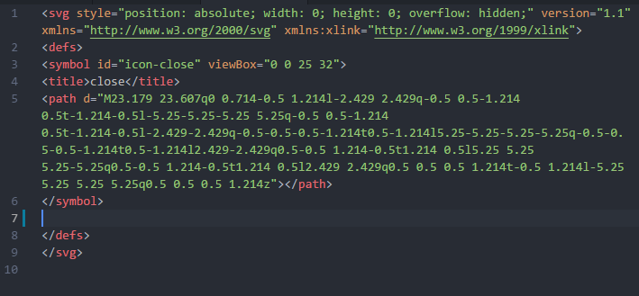

# WApiTis


<!-- **Attention** : En cours de création -->

> WebApp utiliTies pour typescript

## Features

- Générer une application web grâce à [FuseBox](https://fuse-box.org)
- Générer une application electron
- Fichiers d'entrée (main.tsx et electronStart.ts), tsconfig préconfigurés et structure www créés via l'initialisation
- Utilisation de jsx via l'import d'un fichier jsx.ts
- Divers fonctions disponibles grâce à l'import du fichier dom.ts
- Créer vos components et vos classes via une ligne de commande (pour une bonne intégration dans tsconfig.json et faciliter les imports)
- Pré-intégration d'un service-worker, permettant à la web app de fontionner hors ligne

**TODO :**
- Commiter un exemple d'utilisation sur un autre git (Speedui)
- Intégration de [Capacitor](https://capacitor.ionicframework.com/)
- Gestion d'une liaison avec IndexedDB dans le Service Worker pour les données provenant d'une base de données
- Icon de electron en prod


## Install

    npm i wapitis -D

## Usages

- Créer un dossier src
- npm install
- npx wapitis init
- Modifier les fichiers du dossier www, contenant les fichiers main.css, icons.svg, manifest.json et icons pour la webapp
- Utiliser wapitis **$ generate class path/du/fichier.ts(x)** ou **$ generate component path/du/fichier.tsx** pour générer vos fichiers
- Pour l'utilisation du component, voir la section Typescript
- Intégrer vos icons dans le fichier icons.svg

- Intégrer vos css dans le fichier main.css
- Le point de départ est le dossier main.ts
- Modifier le fichier electronStart si besoin
- Coder avec [typescript](https://www.typescriptlang.org)
- Pour l'utilisation de DOM et JSX, voir la section Typescript
- Compiler avec wapitis dev, prod ou electron
- Le dossier dist contient le résultat de la transpilation (html ou electron)

### CLI

**$ npx wapitis** pour obtenir l'aide :

    $ npx wapitis init --> initialise la web app en créant les fichiers et les dossiers nécessaires

    $ npx wapitis dev --> lance la web app dans un serveur local. --webapp pour générer service worker, manifest et polyfills

    $ npx wapitis prod --> web app pour la production

    $ npx wapitis electron --> lance la webApp dans electron avec un serveur local (--dev) ou pour la production(--prod)

    $ npx wapitis clear --> supprime le cache et le dossier dist

    $ wapitis generate class path/du/fichier.ts(x) --> génère une classe relatif à src. tsConfig est mis à jour

    $ wapitis generate component path/du/fichier.tsx --> génère un composant relatif à src. tsConfig est mis à jour

### Typescript

Import de DOM et JSX
```Typescript
import { DOM, JSX } from "wapitis";
```
Exemple d'utilisation de DOM
```Typescript
this._icon = DOM.addIcon(this.type, this._renderElements.parentNode as HTMLElement, this._renderElements);
```
DOM possède les méthodes suivantes :
```Typescript
addIcon(name: string, parent: HTMLElement, elementAfter?: Node | null): SVGSVGElement {};
changeIcon(svg: SVGSVGElement, name: string): SVGSVGElement {};
removeIcon(svg: SVGSVGElement, parent: HTMLElement) {};
setAttribute(element: HTMLElement, name: string, value: any) {};
generateId() {};
dispatchEvent(name: string, property: object, parent: HTMLElement = document.body) {};
getWindowSize() {};
parseStyleToNumber(style: string | null) {};
removeClassByPrefix(element: HTMLElement, prefix: string) {};
```
JSX utilisé dans la fonction render() du component
```Typescript
_render() {
    return (
        <div>
            <div class="bbox"></div>
        </div>
    );
}
```
La fonction connectedCallback() permet de déclarer les éléments de la fonction render()
```Typescript
this._bbox = this._renderElements.querySelector(".bbox") as HTMLElement;
```
Le component permet de mettre la structure html dans la fonction render() (Cf. plus haut) et les styles dans la fonction style
```Typescript
_style() {
    return  `
        span {
            display: none;
        }
    `;
}
```
La déclaration d'un component s'exécute ainsi :
```Typescript
@Component.register("prefixe-balise")

export default class Balise extends Component {
}
```
disconnectedCallback() et attributeChangedCallback(attrName: string, oldVal: any, newVal: any) à utiliser comme dans n'importe quel Custom Element

### Service Worker
Possibilité de récupérer un message pour préciser que le cache a été mis à jour
```JS
navigator.serviceWorker.addEventListener('message', event => {
    // ...
    console.log(event.data.msg, event.origin);
});
