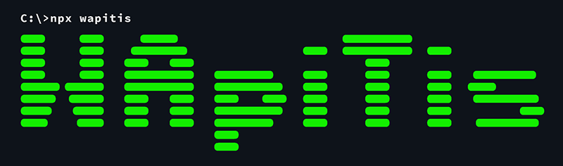

# WApiTis 2 <!-- omit in toc -->


> WebApp utiliTies est un set d'outils pour développer et compiler une application web avec ou sans client lourd. Il ne s'agit pas d'un framlework. Il ne contient pas de composants préexistants (cela sera l'objet d'un autre projet).
>
> L'idée est de faciliter la mise en oeuvre de composants grâce aux web components et à la surcouche qui y est apportée, et de rendre leur compilation plus simple.
>
> Afin de faciliter la compilation de cette application, des scripts en ligne de commanbde permettent très rapidement d'initialiser, de tester et de publier en production pour une sortie sur le Web ou dans une épplication packagée.

## Technologies utilisées

Pour développer plus facilement et permettre une mise en place plus facile des composants, Wapitis utilise les [webcomponents](https://developer.mozilla.org/fr/docs/Web/Web_Components). Plus particulièrement une surcouche y est apportée ajoutant encore plus de simplicité.

Cette surcouche fonctionne un peu comme [LitElement](https://lit-element.polymer-project.org/). Au lieu d'étendre HTMLElement, le composant créé étend une classe de base appelé `Component` permettant:
- d'accéder simplement au cycle de vie du composant
- d'appliquer un style
- de créer des propriétés dynamiques ou non
- de mettre à jour le contenu

Le langage utilisé est [typescript](https://www.typescriptlang.org), permettant un contrôle plus poussée des types et des classes et une aide à la saisie facilitée.

Pour mettre à jour le contenu, Wapitis se base sur [lit-html](https://lit-html.polymer-project.org/) qui vous permet d'écrire des modèles HTML en JavaScript à l'aide de template et d'expressions JavaScript intégrées. lit-html identifie les parties statiques et dynamiques de vos modèles afin qu'il puisse mettre à jour efficacement uniquement les parties modifiées.

En utilisant lit-html, Wapitis met à jour le contenu dans des shadow DOM et ajoute une API pour gérer les propriétés et les attributs. Il est alors possible de décider quelles propriétés seront observées et les éléments sont alors mis à jour de façon asynchrone seulement à l'endroit où les propriétés changent ou interagissent avec le contenu.

Une librairie de fonctions est également disponible afin de permettre d'accéder rapidement aux différents éléments du DOM ou du shadow DOM.

Afin de faciliter la diffusion, Wapitis utilise [FuseBox](https://fuse-box.org) pour compiler rapidement des versions de dev ou de prod. Ajoutons à cela l'utilisation d'[electron](https://electronjs.org/) pour concevoir des applications sous forme de client lourd installable, le tout intégré de façon simple et facilement accessible.

L'utilisation des lignes de commandes permet ainsi d'accéder rapidement et facilement à toutes ces fonctions sans avoir besoin de configurer quoi que ce soit.

## Disclaimer

Il existe d'autres librairies plus connues ou plus puissantes comme React ou LitElement, alors pourquoi Wapitis ?

Premièrement, de mon côté, cela me permet un contrôle sur tous les élements composants cet outil, qu'il s'agisse de ce que je veux intégrer et de comment cela est codé. D'autre part cela assure que ce qui est inclus est utile.

Enfin il s'agit d'un outil complet de création de WebApp, icluant tout ce qui est nécessaire, avec simplicité.

Afin de gérer correctement l'affichage de lit-html et typescript, j'utilise pour ma part [Visual Studio Code](https://code.visualstudio.com/) avec quelques plugins dont :
- [lit-plugin](https://marketplace.visualstudio.com/items?itemName=runem.lit-plugin)
- [TSLint](https://marketplace.visualstudio.com/items?itemName=ms-vscode.vscode-typescript-tslint-plugin)

electron a été bloqué à la version  7.1.1 car la verion 7.1.4 avait un bug avec electron-updater : `redirect was cancelled sur un test de update-available`. Dès que possible, je reviendrais sur la version en cours.

Lors de l'installation d'un executable via electron, windows a un avertissement lié à son application smart screen. Les seules solutions pour éviter cette avrtissement sont :
- signer l'application (ce qui coute de l'argent)
- ignorer cette alerte
- désactiver smart screen ;)

**TODO :**
- Intégration de [Capacitor](https://capacitor.ionicframework.com/)
- Gestion d'une liaison avec IndexedDB dans le Service Worker pour les données provenant d'une base de données

## Features

- Générer une application web grâce à [FuseBox](https://fuse-box.org)
- Générer une application [electron](https://electronjs.org/)
- Mise à jour asynchrone du DOM grâce à [lit-html](https://lit-html.polymer-project.org/)
- Utilisation possible de jsx via l'import d'un fichier jsx.ts
- Divers méthodes  disponibles grâce à l'import du fichier log.ts, dom.ts, shadowDom.ts et utils.ts
- Créer vos components et vos classes et générer votre application via des lignes de commande
- Surcouche des web components à travers une classe de base permettant de simplifier la mise à jour de contenus et l'accessibilité au cycle de vie et aux différentes méthodes
- Styler et surcharger les styles directement dans les composants
- Utilisation de SVG pour gérer les icons
- Pré-intégration d'un service-worker, permettant à la web app de fontionner hors ligne

## Install

    npm init
    npm i wapitis -D
    npx wapitis init

## CLI

**$ npx wapitis** pour obtenir l'aide :

    $ npx wapitis init --> initialise la web app en créant les fichiers et les dossiers nécessaires

    $ npx wapitis dev --> lance la web app dans un serveur local. --webapp pour générer service worker, manifest et polyfills

    $ npx wapitis prod --> web app pour la production

    $ npx wapitis electron --> lance la webApp dans electron avec un serveur local (--dev) ou pour la production(--prod)

    $ npx wapitis clear --> supprime le cache et le dossier dist

    $ wapitis generate class path/du/fichier.ts(x) --> génère une classe relatif à src. tsConfig est mis à jour

    $ wapitis generate component path/du/fichier.tsx --> génère un composant relatif à src. tsConfig est mis à jour


## Documentation

- [Pour commencer](./docs/getstarted.md)


## Développer

Pendant le développement, il est recommandé de lancer avant

```
npx wapitis dev
```

ou

```
npx wapitis electron --dev
```
permettant ainsi de mettre à jour ses modifications à la volée grâce au compileur et au watcher intégré


### Component

Le composant intégré est comme nous l'avons vu la pierre angulaire du développement avec wapitis. Il permet de poser rapidement un web component en utilisant un langage simplifié, comme les directives intégrés ou son cycle de vie.

#### La directive custom element <!-- omit in toc -->

```Typescript
@customElement('x-custom')
export default class Custom extends Component<IProps> {
```

permet de créer le nom du composant et de le déclarer comme WebComponent en deux lignes claires en début de fichier.

Il est obligatoire lors de la déclaration dans la directive d'avoir un nom sou la forme `prefixe-component`, en effet cela permet de le différencier des composants web intégré et de la signaler comme custom element. Par convention le nopm donné à la classe reprend en général le nom `Component` avec une majuscule mais cela n'est pas obligatoire.

La proprété générique IPROPS permet la déclaration des propriétés publiques, utilisées ensuite dans le constructeur et permettant la création du composant avec l'écriture `new Composant(IPROPS)`

Pour pouvoir fonctionner, les propriétés doivent être déclarées dans l'interface IPROPS du composant

```Typescript
interface IProps {
    maVariable: string
}
```

Comme on l'a vu dans le composant TodoList, si on ne veux pas de propriétés il est possible de déclarer `{}`

Dans ce cas si on a besoin du constructeur, il prend la forme :

```Typescript
constructor() {
    super()
}
```

#### La directive property <!-- omit in toc -->

En typescript, les propriétés peuvent être publiques, protected ou private. Avec Wapitis, pour rendre des propriétés observables, il faut utiliser la directive @property

Par défaut, cela permet de rendre une propriété observable et de définir par la même occasion un attribut du composant que nous sommes en train de créer.

```Typescript
@property() text: string
```

Le prefixe _ devant le nom permet de rendre la propriété protected tout en restant observable. Elle n'est alors plus déclarable en tant qu'attribut.

Il est possible de passer un objet en paramètre. Cet object peut contenir 3 paramètres:

- type : indique le type à utiliser lors du passage de la propriété à l'attribut et inversement (string par défaut). Important pour préciser comment la conversion doit se faire entre la propriété et l'attribut (qui est obligatoirement un texte). Inutile dans le cas d'une propriété protected mais observable car aucune conversion n'est nécessaire.
- writeOnly : propriété observable non visible dans l'html rendu mais possible de la créer en html ou en javascript (false par défaut)
- reflectInAttribute : la propriété est transformée en attribut, de camelCase vers dashCase (true par défaut) et est observable. Passer ce paramètre à false revient à créer une propriété publique mais non observable.

#### Les custom event et les attributs @event <!-- omit in toc -->

Pour passer des fonctions dans les attributs d'un composant avec Wapitis et permettre à deux composants de communiquer entre eux, on utilisera les customEvents, comme on l'a vu avec le composant Todo

On crée ainsi un customEvent en utilisant la méthode dispatchEvent de la librairie UTILS :

```Typescript
UTILS.dispatchEvent('remove', { index: this.index }, this)
```

Grâce à LitHtml pour ajouter un addEventListener sur le composant on pourra créer un attribut avec @NomDeLevent sur le composant.

```Typescript
${this._todos.map((todo, index) => html`<w-todo ?checked=${todo.checked} text=${todo.text} .index=${index} @remove=${this._removeTodo} @completed=${this._toggleTodo}></w-todo>`)}
```

#### Méthodes et utilisation du cycle de vies <!-- omit in toc -->

Le component a quelques méthodes intégrées qui définissent son cycle de vie.

##### constructor <!-- omit in toc -->
```Typescript
constructor(options: IProps) {
    super(options)
}
```
Appelé lors de la création du composant seulement. Intéressant pour déclarer les variables et propriétés. Possible d'accéder aux propriétés déclarées (props) lors de la création du composant avec new Composant(props).

##### connectedCallback <!-- omit in toc -->
```Typescript
connectedCallback() {
    super.connectedCallback()
}
```
Appelé lorsque l'élément est connecté pour la première fois au DOM du document.

##### attributeChangedCallback <!-- omit in toc -->
```Typescript
attributeChangedCallback(attrName: string, oldVal: any, newVal: any) {
    super.attributeChangedCallback(attrName, oldVal, newVal)
}
```
Appelé lorsque l'un des attributs de l'élément personnalisé est ajouté, supprimé ou modifié.

##### shouldUpdate <!-- omit in toc -->
```Typescript
shouldUpdate(_changedProperties: PropertyValues): boolean {
    return true
}
```
Permet de conditionner le rendu du composant. render() est appelé si la fonction retourne true. Ce qui est le comportement par défaut.
**_changedProperties** permet d'accéder aux propriétés en cours de changement dans leur ancienne et leur nouvelle valeur grâce à une map ```PropertyValues = new Map<PropertyKey, { oldVal: unknown, newVal: unknown }>```

##### beforeRender <!-- omit in toc -->
```Typescript
beforeRender(_changedProperties: PropertyValues) {
    //
}
```
Appelé avant le rendu du composant. Permet d'interagir avec les éléments à chaque appel du composant avant sa création dans le dom.
**_changedProperties** permet d'accéder aux propriétés en cours de changement dans leur ancienne et leur nouvelle valeur grâce à une map ```PropertyValues = new Map<PropertyKey, { oldVal: unknown, newVal: unknown }>```

##### render <!-- omit in toc -->
```Typescript
render() {
    return html`
        <!--  -->
    `
}
```
La méthode permet de créer le composant dans le dom grâce au tag html de lit-html. Il retourne un TemplateResult qui est ensuite interprété et permet la mise à jour du DOM.

##### firstUpdated <!-- omit in toc -->
```Typescript
firstUpdated(_changedProperties: PropertyValues) {
    //
}
```
Appelé lors de la première mise à jour du composant. Utile pour réaliser des actions qui ne doivent avoir lieu qu'une fois, comme la récupération des différents éléments rendu dans la méthode render(). En utilisant les methodes existantes dans les librairies DOM et SHADOWDOM de WAPITIS (cf. plus bas) ou l'API DOM, par exemple avec querySelector et la propriété shadowRoot :
``` Typescript
this._input = this.shadowRoot!.querySelector('input')
```
**_changedProperties** permet d'accéder aux propriétés en cours de changement dans leur ancienne et leur nouvelle valeur grâce à une map ```PropertyValues = new Map<PropertyKey, { oldVal: unknown, newVal: unknown }>```

##### updated <!-- omit in toc -->
```Typescript
updated(_changedProperties: PropertyValues) {
    //
}
```
Appelé lors de chaque mise à jour du composant. Permet de réaliser des tâches après le rendu du composant à chaque appel en utilisant l'API DOM, par exemple pour le focus d'un élément.
**_changedProperties** permet d'accéder aux propriétés en cours de changement dans leur ancienne et leur nouvelle valeur grâce à une map ```PropertyValues = new Map<PropertyKey, { oldVal: unknown, newVal: unknown }>```

##### disconnectedCallback <!-- omit in toc -->
```Typescript
disconnectedCallback() {
    super.disconnectedCallback()
}
```
Appelé lorsque l'élément personnalisé est déconnecté du DOM du document.

#### Slot <!-- omit in toc -->

Lors de la création d'un custom element si on veut permettre l'ajout d'enfant à notre composant, on peut utiliser le principe de slot.

Ainsi, on définit dans la méthode render une balise slot qui appellera tout enfant déclaré dans le composant. Imaginon un composant w-info possédant la méthode render suivante :

```Typescript
render() {
    html`
        <div class='title'>Informations</div>
        <slot></slot>
    `
}
```

Lors de l'appel du composant info on pourra écrire n'importe quel enfant dans le composant qui sera alors appelé à la place du slot dans le DOM.

```Typescript
render() {
    html`
        <w-info>
            <p>Les slot c'est super !</p>
        </w-info>
    `
}
```

Il est également possible d'être plus précis en donnant un nom précis au slot.

```Typescript
render() {
    html`
        <slot name='title'></slot>
        <slot name='content'></slot>
    `
}
```

Dans ce cas lors de l'appel du composant et de la création des enfants, il sera necessaire de préciser à quel slot l'enfant sera affectée :

```Typescript
render() {
    html`
        <w-info>
            <h1 slot='title'>Informations</h1>
            <p slot='content'>Les slot c'est super !</p>
        </w-info>
    `
}
```

Dans ce cas tout autre enfant ne sera pas affecté car le composant w-infos ne contient que deux slots title et content. Il serait possible d'ajouter une balise slot sans nom

```Typescript
render() {
    html`
        <slot name='title'></slot>
        <slot name='content'></slot>
        <slot>
            <p>Contenu par défaut</p>
        </slot>
    `
}
```

Dans ce cas tout autre enfant nom nommé serait affecté à la balise slot. Si aucun autre enfant n'est ajouté, c'est le contenu par défaut qui est utilisé.

Pour sélectionner un élément en slot on doit utiliser le sélecteur ```::slotted()```.

#### Possibilité de lit-html <!-- omit in toc -->

Tout ce qui est possible avec lit html est possible dans wapitis comme:

- le conditionnal rendering. Par exemple :

```Typescript
${this.checked ? html`<svg class="icon"><use href=${icons}#icon-check-circle></use></svg>` : html`<svg class="icon"><use href=${icons}#icon-circle></use></svg>`}
```

- des template de boucles Par exemple :

```Typescript
${this._todos.map((todo, index) => html`<w-todo ?checked=${todo.checked} text=${todo.text} .index=${index} @remove=${this._removeTodo} @completed=${this._toggleTodo}></w-todo>`)}
```

- Tout ce que l'on trouvera sur : [https://lit-html.polymer-project.org/guide/template-reference](https://lit-html.polymer-project.org/guide/template-reference) dont la directive repeat, until, ...

### Style

Dans wapitis la gestion des CSS peut se gérer de plusieurs façons différentes.


#### main.css <!-- omit in toc -->

Le fichiers main.css permet de gérer les css du body et de tout ce qui n'est pas un composant.

#### La propriété statique style <!-- omit in toc -->

Chaque composant ensuite possède ses propres CSS.

Pour les créer on utilise la propriété statique styles associé avec le tag CSS qui permet d'assurer un traitement sécurisé du texte passé en CSS.

```Typescript
static get styles() {
    return css`
    :host {
        font-family: Arial, Helvetica, sans-serif;
        margin: auto;
        width: 25rem;
        display: flex;
        flex-direction: column;
        align-items: center;
    }
    `
}
```

Dans cette propriété, toutes les balises du composant pourront être stylés directement et aucun style provenant d'un autre compoosant n'affectera ce composant.

Pour styler le composant lui même, le sélecteur ```:host()``` doit être utilisé. Pour styler des enfants à l'intérieur d'un slot on utilise ```::slotted(element)```

Il est également possible de surcharger des styles déclarés dans le compopsant parent en utilisant super.styles :

```Typescript
static get styles() {
    const mainColor = css`red`
    return [
        super.styles,
        css`
        :host {
            display: block;
            text-align: center;
        }
        `
    ]
}
```

Ainsi on hérite des styles du composant parent. Inutile dans le cas où on hérite diretcement de Component.

#### Le chargement externe <!-- omit in toc -->

Si on souhaite partager une css entre plusieurs composant il est possible de le faire en déclarant directement dans la méthode render() dans le tag html :
```Typescript
render() {
    return html`
        <link rel="stylesheet" href="styles/sharedCSS.css">

    ...
```

Dans ce cas le fichier css devra être déclaré dans le dossier www/styles

Par ailleurs il faut également réaliser l'import de ce fichier en début de document :
```Typescript
import '../www/styles/sharedCSS.css'
```

#### Surcharge avec slot override <!-- omit in toc -->

Si on veut surcharger les styles d'un composant existant que l'on est en train de déclarer, il est possible de la faire en utilisant une technique spécifique à wapitis. On va pour cela s'appuyer sur les slots et déclarer dans la méthode render :

```Typescript
render() {
    return html`
    ...
        <style slot='override'>
            :host {
                background: pink;
            }
        </style>
    ...
```

#### Utilisation des variables <!-- omit in toc -->

Enfin pour s'approprier un composant graphiquement et si ces dernières ont bien été déclarées, il est possible d'utiliser les variables CSS.

L'utilisation est alors assez simple :
```Typescript
static get styles() {
  return css`
    :host { color: var(--themeColor, black); }
  `;
}
```

```html
<style>
  html {
    --themeColor: #123456;
  }
</style>
<my-element></my-element>
```

Enfin toutes les directives proposées par lit-html sont disponibles dont : classMap et styleMap

cf [https://lit-html.polymer-project.org/guide/template-reference](https://lit-html.polymer-project.org/guide/template-reference)

### Icons, images et font

Comme nous l'avons vu dans le composant Todos, dans wapitis, la gestion des images se fait grâce aux svg et plus précisément à un fichier SVG contenant toutes les images que l'on veut utiliser sous forme de symbole accompagné d'un id.

Il suffit alors d'importer le fichier svg inclus dans www :
```Typescript
import icons from '../www/assets/img/icons.svg'
```

Puis de créer une balise svg pointant vers ce fichier et vers l'id de l'image souhaité.
```Typescript
html`<svg class="icon"><use href=${icons}#icon-check-circle></use></svg>`
```

De cette manière il est facile de changer la couleur et la taille du svg en css.

Il est néanmoins toujours possible d'utiliser des fichiers images png, jpeg ou autres. Il suffit alors d'importer l'image

```Typescript
import image from '../www/assets/img/image.png'
```

Puis d'appeler la variable dans l'attribut src de la balise image
```Typescript
 render() {
    return html``
    ...
```

Il est également possible d'utiliser des fonts (police classique ou icones)

Il suffit ainsi de déclarer la font dans les styles

```CSS
@font-face {
    font-family: "RobotoLight";
    src: url(../assets/fonts/Roboto-Light.ttf) format('truetype');
    font-weight: normal;
    font-style: normal;
}
```

Puis d'appeler la font dans le selecteur choisi

```CSS
body {
    font-family: "RobotoLight";
}
```

### Electron

Avec Wapitis, il est possible de créer une application electron

Pour lancer un test dans une app electron, il suffit d'appeler la ligne de commande

```
npx wapitis electron --dev
```

Une nouvelle fenetre s'ouvre alors contenant l'application electron vers le fichier index.html de la web app.

Par défaut certains éléments sont déclarés dans le fichier electronStart.ts, comme la déclaration des menus, l'appel du fichier index.html pour fonctionner en dev et en prod, la déclaration du splash et de la fenetre about et la liaison avec electron auto update pour permettre de proposer des mises à jour automatiques.

electronStart.ts contient toutes les déclarations nécessaires au bon fonctionnement de l'application electron et en est la porte d'entrée.

Tout peut évidemment être modifié en utilisant la documentation d'electron : [https://electronjs.org/docs](https://electronjs.org/docs)

Il est possible d'ajouter des fichiers dans le dossier electron (où l'on trouve le splash et le fichier about). Ces derniers seront alors automatiquement compiler dans l'application.

On trouve également un fichier index.js dans le dossier electron. Ce fichier permet d'ajouter des scripts dans l'index.html afin de modifier l'application et de faire la liaison avec les messages envoyés par elestronStart.ts

Exemple avec le menu a propos qui envoie le message suivant :

```Typescript
win.webContents.send('show_about',
    {
        appVersion: app.getVersion(),
        chromeVersion: process.versions.chrome,
        electronVersion: process.versions.electron,
        nodeJsVersion: process.versions.node,
        v8Version: process.versions.v8
    }
)
```

Message récupéré dans l'index.js afin de créer la fenetre à propos permettant de voir les versions de l'application et des applications tiers
```Javascript
ipcRenderer.on('show_about', (event, arg) => {
    const style = document.createElement('style')
    style.innerHTML = `.about {
    position: fixed;
    top: 0;
    left: 0;
    width: 100%;
    height: 100%;
}

.container {
    border-radius: 0.3125rem;
    box-shadow: 0 0.0625rem 0.1875rem 0 rgba(0, 0, 0, 0.2), 0 0.0625rem 0.0625rem 0 rgba(0, 0, 0, 0.14), 0 0.125rem 0.0625rem -0.0625rem rgba(0, 0, 0, 0.12);
    width: 40rem;
    position: absolute;
    top: 10rem;
    left: 50%;
    margin-left: -20rem;
    text-align: center;
    background: #fff;
    padding: 0.5rem;
    font-family: monospace;
    font-weight: bold;
    user-select: none;
}

.background {
    background: #000;
    opacity: 0.6;
    width: 100%;
    height: 100%;
}

.credit {
    display: flex;
    justify-content: space-between;
}

.infos {
    padding: 0.5rem
}`
    document.head.appendChild(style)
    const about = document.createElement('div')
    about.classList.add('about')
    about.addEventListener("click", () => document.body.removeChild(about))
    const background = document.createElement('div')
    background.classList.add('background')
    about.appendChild(background)
    const container = document.createElement('div')
    container.classList.add('container')
    about.appendChild(container)
    container.innerHTML = `
<div class="infos">
<div>Version : ${arg.appVersion}</div>
<div>Date : ${new Date().toLocaleDateString()}</div>
<div>Electron : ${arg.electronVersion}</div>
<div>Chrome : ${arg.chromeVersion}</div>
<div>Node.js : ${arg.nodeJsVersion}</div>
<div>V8 : ${arg.v8Version}</div>
</div>
<div class="credit">
<div>© 2019</div>
<div>Tous droits réservés.</div>
</div>`
    document.body.appendChild(about)
})
```

L'ensemble de la liaison entre electron et la web app peut être réalisé de cette façon ou en utilisant ce qui est proposé dans la documentation d'electron.

Lors de la modification des fichiers de la webapp il est inutile de relancer npx wapitis electron --dev, en revanche toutes modifications sur electronStart.ts nécessite de relancer la ligne de commande.

Le favicon.ico intégré dans le dossier www est utilisé comme icon pour l'application.

### Utilitaires

Afin de permettre d'accéder à certaines méthodes utiles, quatre modules ont été créés :

- UTILS - contient différentes méthodes permettant de simplifier certaines actions, comme la génération d'id, la transformation entre différents types, l'envoie de customEvent, la sauvegarde en local storage ...
```Typescript
    /** Transforme une string dans le type renseigné */
    function fromString(value: string | null, type?: unknown): any
    /** Transforme une valeur du type renseigné en string */
    function toString(value: unknown, type?: unknown): any
    /** Transforme une chaine du type camelCase en DashCase */
    function camelCaseToDashCase(name): any
    /** Transforme une chaine du type DashCase en camelCase */
    function dashCaseToCamelCase(name): any
    /** Retourne un id de type string */
    function generateId(): string
    /** Envoie un customEvent sur l'élément parent, avec les propriétés renseignés dans property */
    function dispatchEvent(name: string, property: object, parent: HTMLElement = document.body): void
    /** Retourne la taille et la position de la fenêtre web courante */
    function getWindowSize() : { width: number, height: number, top: number, left: number }
    /** Retourne le texte contenu dans le fichier spécifié de façon asynchrone */
    async function getFile(url: string): string
    /** Enregistre les données dans la clé spécifié en local storage */
    function save<T>(key: string, datas: T): void
    /** Retourne les données spécifié dans la clé en local storage */
    function load<T>(key: string): T
```

- DOM - contient des méthodes permettant de manipuler le dom
```Typescript
    /** Assigne l'attribut spécifié et sa valeur à l'élément spécifié. Si isStyle, l'ajoute en tant que que style */
    function setAttribute(element: HTMLElement, name: string, value: any, isStyle?: boolean): void
    /** Transforme un style en nombre */
    function parseStyleToNumber(style: string): number
    /** Supprime la classe contenant le préfix renseigné */
    function removeClassByPrefix(element: HTMLElement, prefix: string): void
    /** Assigne la propriété renseignée dans le style si la valeur est différente. Retourne true dans ce cas */
    function setStyle(element: HTMLElement, name: string, value: string): boolean
```
- SHADOWDOM - contient des méthodes permettant de manipuler et de retrouver les shadowdom entre eux
```Typescript
    /** Retrouve le host du shadowTree de ce noeud. */
    function findHost<T extends Element = Element>(from: Node): T
    /** Retrouve le 1er DocumentOrShadowRoot ancêtre d'un noeud. */
    function findDocumentOrShadowRoot(from: Node): Document | ShadowRoot
    /** Retourne le parent, incluant la balise <slot> dans la chaine. */
    function deepClosestElement(selector: string, base: Element): Element
    /** Retrouve l'activeElement en pénétrant tous les shadowDOM. */
    function findDeepActiveElement(from?: DocumentOrShadowRoot): Element
    /** Retrouve tous les éléments assignés dans les slot de l'élément courant. */
    function findAssignedElements(from: Element): Element[]
    /** Retrouve le ou les éléments assignés dans le slotName. */
    function findAssignedElementBySlotName(from: Element, slotName: string): Element | Element[]
    /** Retrouve les éléments spécifiés dans le selector en fonction du root ou du document. */
    function querySelectorAllDeep(selector: string, root?: Element | Document): Element[]
    /** Retrouve l'élément spécifié dans le selector en fonction du root ou du document. */
    function querySelectorDeep(selector: string, root?: Element | Document): Element
```

- LOG - permet de faire différents type de log dans la console JS
```Typescript
    /** log classique avec le message renseigné et les données datas si elles existent. */
    function info(message: string, ...datas: any[]): void
    /** log de type debug avec le message renseigné et les données datas si elles existent. */
    function debug(message: string, ...datas: any[]): void
    /** log de type warn (marron sur fond jaune) avec le message renseigné et les données datas si elles existent. */
    function warn(message: string, ...datas: any[]): void
    /** log de type error (rouge sur fond rose) avec le message renseigné et les données datas si elles existent. */
    function error(message: string, ...datas: any[]): void
```

Il est également possible d'utiliser JSX en important le module JSX. Exemple :
```Typescript
    import { JSX } from 'wapitis'
    ...
    document.body.appendChild(<div>Contenu</div>)
```

## Compiler

La compilation peut s'effectuer de différentes manières, en dev ou en prod, pour electron ou pour le web

### Service Worker

Lors de la compilation en prod ou en dev avec --webapp pour le web, un service worker est généré. Ce dernier permet d'enregistrer dans le cache du navigateur les différents éléments composant la webapp, permettant ainsi de la consulter offline.

Comme vu lors, de l'exemple TODO, il permet aussi d'accéder aux boutons donnant accès à l'installation en tant qu'application autonome et activant les notifications.

### Le manifest

Dans le dossier www, un fichier manifest.json est présent. Il est rempli par défaut, mais il est possible de le modifier :

```JSON
{
    "short_name": "NomDeLApp",
    "name": "NomDeLApp",
    "icons": [
        {
            "src": "/assets/icons/icons-192.png",
            "type": "image/png",
            "sizes": "192x192"
        },
        {
            "src": "/assets/icons/icons-512.png",
            "type": "image/png",
            "sizes": "512x512"
        }
    ],
    "start_url": "/",
    "background_color": "#FFFFFF",
    "display": "standalone",
    "scope": "/",
    "theme_color": "#317EFB"
}
```
Voir [https://developer.mozilla.org/fr/docs/Mozilla/Add-ons/WebExtensions/manifest.json](https://developer.mozilla.org/fr/docs/Mozilla/Add-ons/WebExtensions/manifest.json)

Ce fichier est nécessaire pour permettre à la webapp de s'installer en tant qu'application autonome.

### clear

```
npx wapitis clear
```
Cette ligne de commande permet de supprimer le cache et de supprimer les éventuelles anciennes compilations.

### generate

Comme vu dans l'exemple TODO, pour générer les fichiers il est conseillé d'utiliser les signes de commandes suivantes

```
npx wapitis generate class path/du/fichier.ts(x)
```
et
```
npx wapitis generate component path/du/fichier.ts(x)
```

La première permet de créer une classe  contenant divers éléments par défaut.

La deuxième permet de créer un composant dérivant de component et les divers éléments disponibles. Il est vivement conseillé d'utiliser cette ligne de commande lors de la création d'un composant car des commentaires d'aide y sont apporté et la structure du component est disponible par défaut.

### dev et prod

En web, on peut compiler pour le dev :
```
npx wapitis dev
```
Cela permet d'accéder à un serveur en localhost à l'adresse suivante : http://localhost:4444/

Toute modification est mise à jour automatiquement sans avoir à relancer la ligne de commande

Si besoin de tester, on peut ajouter --webapp, qui permet de générer le service worker et les différents fichiers permettant le fonctionnement hors ligne de l'application. Attention toutefois, car dans ce cas la mise à jour automatique ne pourra plus être effective.

On peut également compiler pour la prod :
```
npx wapitis prod
```

Dans ce cas les fichiers sont alors rendus disponibles dans un dossier dist. Ces fichiers peuvent ensuite être envoyés sur un serveur.

Si les fichiers sont sur un git, il est également possible d'utiliser cette ligne de commande avec un service du type [netlify](https://www.netlify.com/)

### electron dev prod publish

Comme vu précédemment, il est possible de générer et de tester une application dans electron avec :
```
npx wapitis electron --dev
```
Cela ouvre une fenetre d'application electron contenant un lien vers la webapp.

Toute modification de la webapp met à jour automatiquement l'application.

Pour publier en prod une application de type electron, deux possibilités existent:
```
npx wapitis electron --prod
```
et
```
npx wapitis electron --publish
```
Dans le premier cas, on obtient un executable ou un fichier installable sous mac ou sous linux qui peut ensuite être utilisé pour installer l'application.

Le deuxième est utile si les sources sont sur git. Cela permet alors d'obtenir des mises à jour automatique.

Pour ce faire, il est alors demander de rentrer le provider et le personal access token permettant de donner accès aux sources (plus d'infos sur la procédure pour Github [ici](https://help.github.com/en/github/authenticating-to-github/creating-a-personal-access-token-for-the-command-line.))).

Une fois cela fait et le tout recompilé avec succès, il ne reste plus qu'à passer les sources en release sur votre git.

## API

> A venir
