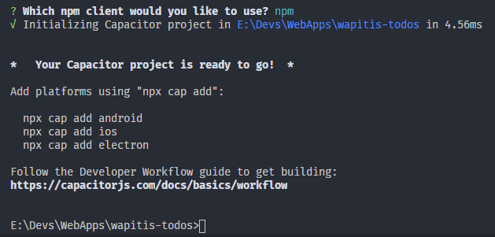

# Capacitor

New - 2.1.40
{: .label .label-purple }

A partir de la version 2.1.40, [Capacitor](https://capacitorjs.com/) est intégré dans Wapitis. [Capacitor](https://capacitorjs.com/) permet de transformer simplement votre web app en application mobile pour Android ou IOS.

Lors de l'installation de Wapitis (ou de la migration si Wapitis est déjà installé), Capacitor est intialisé afin de créer les variables nécessaire à son fonctionnement. Le fichier ```capacitor.config.json``` est alors créé contenant les informations demandées :




```json
{
  "appId": "fr.wapitis.wapitistodos",
  "appName": "wapitistodos",
  "bundledWebRuntime": false,
  "npmClient": "npm",
  "webDir": "dist",
  "plugins": {
    "SplashScreen": {
      "launchShowDuration": 0
    }
  },
  "cordova": {}
}
```

**ATTENTION : appId ne doit pas contenir de - et doit respecter la forme proposée : fr.wapitis.`appName` !**

Vous devrez alors ajouter la plateforme de votre choix en utilisant la ligne de commande :

```bash
npx wapitis capacitor add android
```

ou

```bash
npx wapitis capacitor add ios
```

(les lignes de commande proposée par Capacitor peuvent également être utilisée, mais celles de Wapitis sont optimisées pour un bon fonctionnement avec Wapitis).

Dans l'exemple utilisé ci dessus qui reprend la webapp Todos de la partie "Pour commencer" et comme je suis sur Windows, j'ai lancé

```bash
npx wapitis capacitor add android
```

Pour compiler, tester l'appication ou déployer l'application, vous aurez besoin d'Android Studio pour Android ou de XCode pour IOS (un mac est nécessaire dans ce cas). Etant sur Windows, j'ai installé [Android Studio](https://developer.android.com/studio), puis il suffit de lancer :

```bash
npx wapitis capacitor run android
```

La première fois vous obtiendrez ce message :


vous précisant qu'il faut ajouter le path vers Android Studio dans ```capacitor.config.json```. Ayant installé la version proposé par JetBrains ToolBox, mon path se présente ainsi :

```json
{
  "appId": "fr.wapitis.wapitistodos",
  "appName": "wapitistodos",
  "bundledWebRuntime": false,
  "npmClient": "npm",
  "webDir": "dist",
  "plugins": {
    "SplashScreen": {
      "launchShowDuration": 0
    }
  },
  "cordova": {},
  "windowsAndroidStudioPath": "C:\\Users\\elend\\AppData\\Local\\JetBrains\\Toolbox\\apps\\AndroidStudio\\ch-0\\193.6626763\\bin\\studio64.exe"
}
```

Une fois cela fait, la commande

```bash
npx wapitis capacitor run android
```

compile et ouvre Android Studio avec les fichiers nécessaires au test et à la création d'une application Android :


La première fois Gradle devra télécharger divers fichiers et se synchroniser avec l'application. Divers messages indiquent les composants éventuels à télécharger et installer. Dans mon cas, j'ai dû installer Android 29 via le SDK manager :


Il a également été nécessaire de créer un virtual device via AVD Manager :


Mais il est également possible de brancher un vrai téléphone en USB en mode dévelopeur.

Un fois cela fait, il ne reste plus qu'à lancer un test via le menu ```run/debug``` pour obtenir notre test :


N'hésitez pas à regarder la [documentation de Capacitor](https://capacitorjs.com/docs), elle est très complète et pleine d'informations sur le fonctionnement d'Android Studio ou XCode.